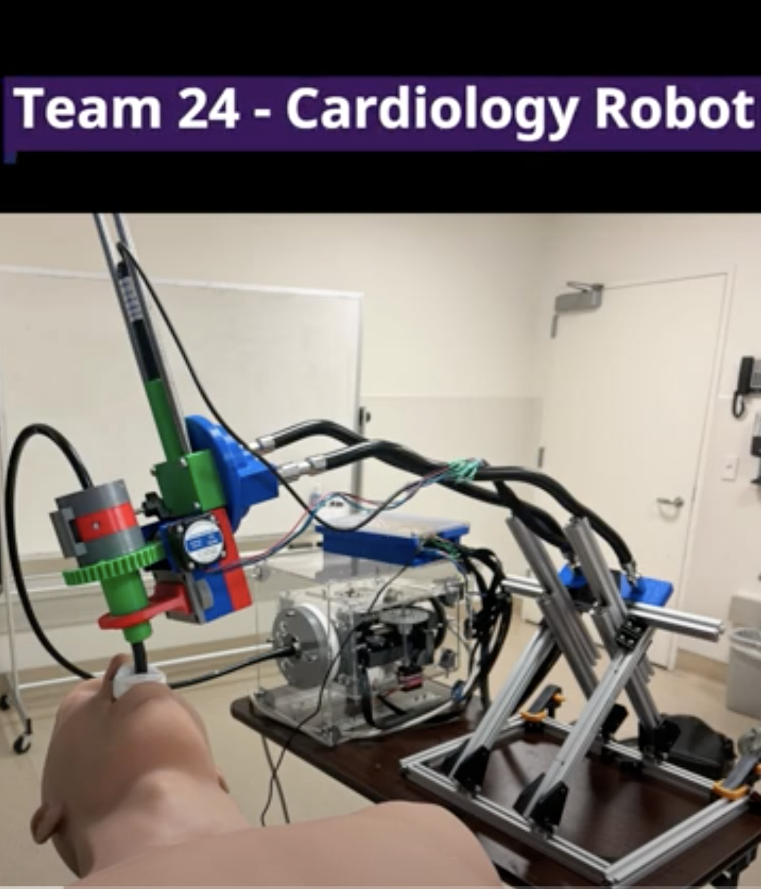
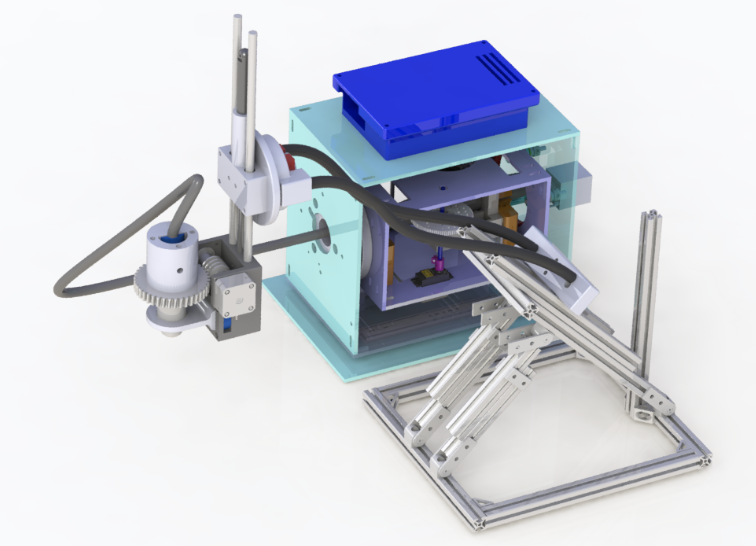
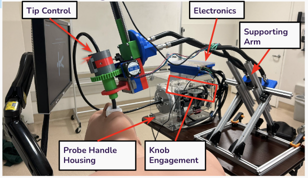
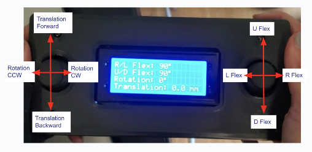

# MAE156A_RobotAssistantCardiologist

<h2>Project Background:

<h6>Transesophageal Echocardiography (TEE): ultrasound imaging technique for the heart. It is used to analyze heart defects and guides repair of valves. This procedure is conducted from inside the food pipe (esophagus) via a catheter.
  

<h2>Problem Definition Overview:

<h6>The current manual procedure is time Consuming (2 hours long), ergonomically challenging, has limited precision, and extensive exposure to harmful x-ray radiation from fluoroscopy.
 <h4>**Our goal: Remotely operate procedure after initial manual catheter insertion.**</b>

<h6>Diagram of Existing Manual Procedure:   

Diagram of Procedure Setup with our Mechanism

<h2>Project Video:   

<h2> Schematic of Overall Design:   

<h2> CAD Rendering of Design:   

<h2> Final Fabrication:   

<h2> Controller:

<h6> This allows for full control of rotatiton of tip and housing, linear translation, knob engagement, step size adjustment, multi-plane angle control, and position memory as shown in the video. 

<h2> Contributions:

<h6> Anika Bhattacharya: Knob Engagement and Housing Design 
Cristian Nunez-Alcazar: Manuafacturing Lead, Multiplane Angle Design 
Noah Jones: Custom Stepper and Linear Actuator Libraries, Tip Control Mechanism, Arm Design 
Nithya Srinivasan: Software Lead, Knob Engagement Design, Arm Fabrication